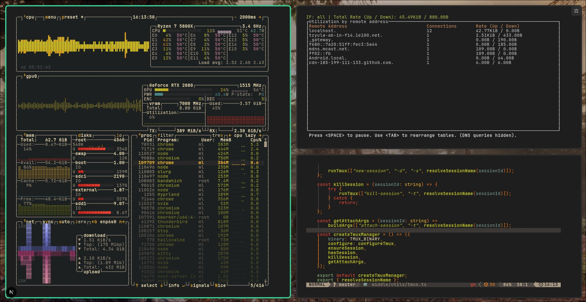

# Orbit Window Manager (Orbit WM)



Orbit WM is a **browser-based tiling window manager** for terminals (and local dev browser windows).

It turns any browser (tablet, TV, spare laptop, iPad) into a tiled terminal “desktop”.
You get multiple terminals and dashboards on one screen, layouts that come back after a restart, and a setup that looks and feels like a real window manager without installing a full Linux desktop or giving everyone SSH access.

**TL;DR, Orbit WM is useful if you:**
- Run a lot of terminals and dashboards
- Like tiling window managers (Hyprland-style)
- Want this to just work in any modern browser


## Why would you use this?

**For solo devs**
- You want a Hyprland-style tiling layout, but you’re stuck on macOS, Windows, or iPad.
- You want your terminals, logs, and browsers to reopen exactly how you left them.
- You’re tired of juggling tabs and manually resizing panes every time you start working.

**For teams / offices**
- You want a TV dashboard that shows logs, `htop`/`btop`, metrics, and status pages.
- You want to show live server output to coworkers without giving them SSH access.
- You want a “war room” view everyone can see in the browser during incidents.

**For mobile / tablet users**
- You have a tablet and want to quickly show multiple terminals on it for development.
- You want your Linux rice (colors, fonts, wallpaper) on an iPad or tablet.
- You hate how clunky most mobile terminal apps feel, especially on iOS.
- You want to plug a tablet into a monitor and get a “fake desktop” made of terminals.

**Quality-of-life benefits**
- **Stop rearranging windows**: layouts are saved and restored automatically.
- **Don’t lose work**: sessions are backed by tmux, so terminals survive browser reloads.
- **Use any screen**: browser-only, so it works on TVs, thin clients, or borrowed machines.
- **Looks good by default**: wallpapers, gaps, borders, and terminal theming built in.
- **Keyboard-first**: fast navigation and swapping without touching the mouse.

**It’s designed for “desktop-like” multi-window workflows inside a single web page:**
- Multi-terminal dev workflows in a single browser window
- Live dashboards for logs/metrics on a shared screen
- Persistent workspaces that reopen as you left them (layout + session metadata)
- Fast keyboard-driven focus/swap navigation (dwindle-style layout)
- A local “middle layer” that keeps terminal sessions reliable by using tmux


## Quickstart (dev)
- Node.js (recommended: 20+)
- `tmux` available on your PATH
- `caddy` available on your PATH
- Build tools for native Node modules (for `node-pty`)
  - macOS: Xcode Command Line Tools
  - Linux: `build-essential` (or equivalent), plus Python 3

### Install
```bash
npm install
```

### Run (one command)
```bash
npm run orbit:dev
```

Orbit prints the LAN URL at startup, for example:
`https://192.168.1.50:43123`

Internal services are started automatically:
- Next dev server on `127.0.0.1:43121`
- Middle layer on `127.0.0.1:43120`
- Caddy TLS proxy on `0.0.0.0:43123`

### What Caddy does
Caddy is the HTTPS front door for Orbit.

Orbit has two internal HTTP services running on loopback:
- frontend (`127.0.0.1:43121`)
- middle API + Socket.IO (`127.0.0.1:43120`)

Caddy listens on `https://<your-ip>:43123`, handles TLS (`tls internal`), and forwards traffic:
- `/api/*` and `/socket.io/*` -> middle layer
- everything else -> frontend

So from your phone/tablet you only use one URL, and the browser sees a single secure origin for UI + API + WebSockets.

## How it works

### Terminal sessions
When you create a terminal window:
1. The frontend `POST`s `middle` at `POST /api/session`
2. The middle layer creates a **tmux session** (server name defaults to `orbit`, sessions are named `orbit-<sessionId>`)
3. The middle layer spawns a PTY attached to tmux and exposes it over Socket.IO at the `/terminal` namespace
4. The browser connects to Socket.IO with `{ auth: { sessionId } }` and streams input/output

### Persistence model
- **SQLite:** `middle/db.sqlite` stores session metadata (`sessions` table) and UI config (`config` table)
- **tmux:** holds the actual terminal processes
- **Browser localStorage:** stores the workspace session id as `orbitSessionId`

If the middle layer restarts, it can restore sessions from SQLite *if the tmux session still exists*.

## Usage

### Creating windows
Use the menu button (top-right) → **New**:
- **Terminal**: creates a tmux-backed terminal session
- **Browser**: creates an iframe-based browser window

### Keyboard shortcuts
Orbit WM uses a modifier key (currently defaults to **Ctrl**).

- `Ctrl+Enter`: New terminal window
- `Ctrl+Arrow keys` or `Ctrl+h/j/k/l`: Focus neighbor (left/down/up/right)
- `Ctrl+Shift+Arrow keys` or `Ctrl+Shift+H/J/K/L`: Swap with neighbor
- `Ctrl+q`: Close active window

Browser windows:
- `Ctrl+q` / `Cmd+q` inside the iframe attempts to close that browser window
- Holding `Ctrl` temporarily disables iframe pointer events (useful for dragging windows over embedded pages)

### Drag to swap
Drag a window by its title bar and drop it onto another window to swap their positions.

### Appearance & wallpaper
Menu → **Wallpaper / Terminal / Layout**:
- Switch between built-in wallpapers or upload a custom wallpaper
- Adjust terminal padding, opacity, color, and font
- Adjust layout gap, borders, and shadows

## Configuration

### Frontend environment variables (Next.js)
Set these in `.env.local` (optional):
- `NEXT_PUBLIC_MIDDLE_URL`: Full URL for the middle layer (example: `http://localhost:4001`)
- `NEXT_PUBLIC_MIDDLE_PORT`: Port used to construct the middle layer URL when `NEXT_PUBLIC_MIDDLE_URL` is not set (default: `4001`)

### Middle layer environment variables
Provide these when starting `npm run middle:dev`:
- `MIDDLE_PORT`: HTTP port for the middle layer (default: `4001`)
- `MIDDLE_HOST`: bind host for middle layer (default: `127.0.0.1`)
- `CLIENT_ORIGIN`: Comma-separated allowlist for CORS origins (example: `http://localhost:43123`)
- `ORBIT_TMUX_BIN`: Path to `tmux` (default: `tmux`)
- `ORBIT_TMUX_SERVER`: tmux server name passed to `tmux -L` (default: `orbit`)
- `ORBIT_TERMINAL_REPLAY_BYTES`: Max bytes of terminal output to replay to newly connected clients (default: `200000`)
- `ORBIT_DEBUG_PTY_OUTPUT`: Set to `1` to log PTY output on the server

### One-command dev environment variables
`npm run orbit:dev` supports:
- `ORBIT_HTTPS_PORT` (default: `43123`)
- `ORBIT_MIDDLE_PORT` (default: `43120`)
- `ORBIT_NEXT_PORT` (default: `43121`)

Example:
```bash
ORBIT_HTTPS_PORT=43123 ORBIT_MIDDLE_PORT=43120 ORBIT_NEXT_PORT=43121 npm run orbit:dev
```

## API (middle layer)

Sessions:
- `POST /api/session` → create a new terminal session
- `GET /api/sessions` → list sessions
- `GET /api/session/:id` → fetch session metadata
- `PATCH /api/session/:id` → update session metadata (`name`, `data`, `isActive`)
- `DELETE /api/session/:id` → destroy session (kills PTY + tmux session)

Config:
- `GET /api/config` → fetch key/value config
- `POST /api/config` → upsert `{ key, value }`

Wallpaper:
- `POST /api/wallpaper` (multipart form-data field: `file`) → saves to `public/wallpapers/` and returns `{ url }`

WebSockets:
- Socket.IO namespace: `/terminal`
- Client auth: `{ sessionId }`
- Events:
  - `input` → `{ sessionId, data }`
  - `resize` → `{ sessionId, cols, rows }`
  - `output` (server → client) → `{ sessionId, data }`
  - `exit` (server → client) → `{ sessionId, code, signal }`

## Production-ish run

1) Start the middle layer:
```bash
npm run middle:dev
```

2) Build and start Next.js:
```bash
npm run build
PORT=43123 npm run start
```

## Troubleshooting

- **“tmux: command not found”**: install tmux or set `ORBIT_TMUX_BIN` to the full path.
- **`caddy: command not found`**: install Caddy and ensure `caddy` is on your PATH.
- **`CERT_AUTHORITY_INVALID` on phone/tablet**: expected with `tls internal` until the device trusts Caddy's local CA at `.orbit/xdg-data/caddy/pki/authorities/local/root.crt`.
- **CORS errors / blocked requests**: set `CLIENT_ORIGIN=http://localhost:43123` (or your actual frontend origin).
- **`node-pty` install/build failures**: install platform build tools (see prerequisites).
- **Stale sessions / weird state**: stop servers, kill the tmux server (`tmux -L orbit kill-server`), and remove `middle/db.sqlite` (this resets persisted sessions/config).

## Security notes

The middle layer is a **local shell/session orchestrator**. It is not hardened for exposure to untrusted networks:
- It currently has **no auth** and binds by default in a way that may be reachable on your LAN.
- Do not run it on a public interface, do not port-forward it, and treat it like a privileged local service.

## Repo layout
- `src/`: Next.js app + UI components + MobX state
- `middle/`: Express/Socket.IO middle layer, tmux + SQLite integration
- `public/`: wallpapers, fonts, PWA assets
- `ghostty-web/`: local dependency for the in-browser terminal renderer
